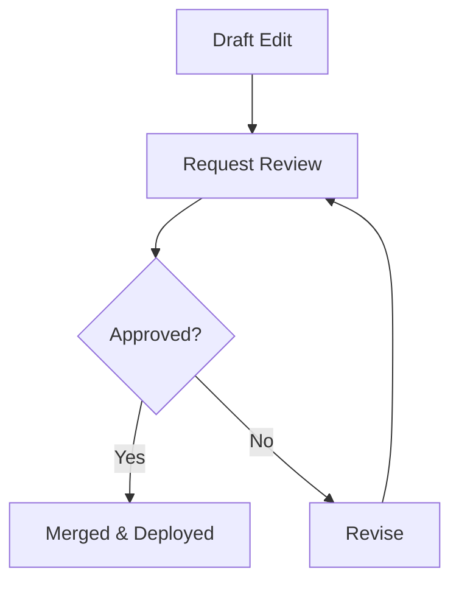

## Overview

Gwerna organizes your documentation into structured environments that scale with your team's needs. You define spaces to group related docs, use schemas to enforce content consistency, and leverage workflows for collaborative editing. These concepts form the foundation for maintaining high-quality, version-controlled documentation.

<Columns cols={3}>
  <Card title="Spaces" icon="layers" href="#documentation-spaces">
    Group docs logically across projects.
  </Card>
  <Card title="Schemas" icon="file-text" href="#content-models">
    Define reusable content structures.
  </Card>
  <Card title="Workflows" icon="git-branch" href="#workflows">
    Automate reviews and updates.
  </Card>
</Columns>

## Documentation Spaces vs. Projects

Gwerna distinguishes between `spaces` and `projects` to provide flexibility. A space acts as a top-level container for multiple projects, ideal for company-wide docs. Projects live within spaces and focus on specific initiatives, like API references or user guides.

<Tabs>
  <Tab title="Spaces" icon="globe">
    Use spaces for broad organization. They support cross-project search and permissions.

    ```yaml
    spaces:
      - id: company-docs
        name: Company Documentation
        projects:
          - api-guide
          - user-manual
    ```
  </Tab>
  <Tab title="Projects" icon="folder">
    Projects contain actual MDX files and assets. Assign team roles per project.

    ```yaml
    projects:
      - id: api-guide
        spaceId: company-docs
        files:
          - concepts.mdx
          - quickstart.mdx
    ```
  </Tab>
</Tabs>

<Callout kind="tip">
  Start with one space per team, then add projects as your docs grow. Migrate projects between spaces using the CLI.
</Callout>

## Content Models and Schemas

Content models in Gwerna use JSON schemas to validate your MDX structure. Define fields like titles, descriptions, and custom properties to ensure consistency across docs.

<CodeGroup tabs="Schema,Usage">
  ```json
  {
    "$schema": "https://json-schema.org/draft/2020-12/schema",
    "type": "object",
    "properties": {
      "title": { "type": "string" },
      "description": { "type": "string" },
      "tags": { "type": "array", "items": { "type": "string" } }
    },
    "required": ["title", "description"]
  }
  ```
  ```yaml
  # frontmatter in your .mdx file
  ---
  title: API Authentication
  description: Secure your API calls with Gwerna tokens.
  tags: ["security", "api"]
  ---
  ```
</CodeGroup>

Apply schemas at the space or project level via the dashboard at `https://dashboard.gwerna.io`.

## Workflows for Updates and Reviews

Streamline changes with Gwerna's built-in workflows. You create approval chains for pull requests, automate previews, and trigger deployments.

<Steps>
  <Step title="Draft Changes" icon="edit-3">
    Edit MDX files in your project. Gwerna generates live previews.
  </Step>
  <Step title="Request Review" icon="users">
    Assign reviewers. Use `@mentions` for notifications.
  </Step>
  <Step title="Approve & Merge" icon="git-merge">
    Reviewers approve via the dashboard. Merge triggers builds.
  </Step>
</Steps>



## Integration with Version Control

Gwerna syncs seamlessly with Git providers. Connect your repo to a project, and Gwerna mirrors branches for previews.

```bash
# Connect via CLI
gwerna connect --repo gwerna/docs --space company-docs --branch main
```

Push changes to trigger workflows:

```
git add .
git commit -m "Update concepts"
git push origin main
```

<ParamField path="repo" param-type="string" required="true">
  GitHub, GitLab, or Bitbucket repository URL.
</ParamField>

<ParamField header="Authorization" param-type="string" required="true">
  Personal access token with repo permissions.
</ParamField>

## Scalability for Team Environments

<Expandable title="Advanced Scaling Tips" default-open="false">

For large teams, configure role-based access:

| Role       | Permissions                  |
|------------|------------------------------|
| Owner      | Full access, space management |
| Editor     | Edit & review docs           |
| Viewer     | Read-only access             |
| Admin      | Manage workflows & integrations |

Enable webhooks for custom notifications:

```json
{
  "url": "https://your-webhook-url.com/gwerna",
  "events": ["pull_request", "deployment"]
}
```

</Expandable>

Master these concepts to build robust documentation pipelines in Gwerna. Explore the [quickstart](/quickstart) next for hands-on setup.